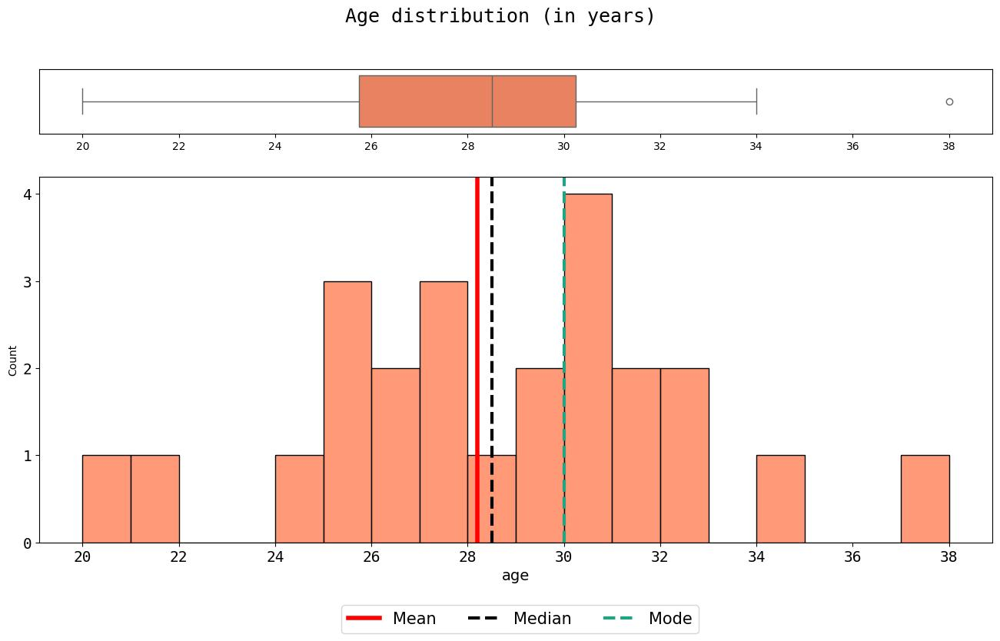

# Personal Data Viz Creations: a collection of my vizualization experiments 

Data viz is a skill, from picking the appropriate chart, to choosing expressive and harmonic aesthetic elements, and transmitting information effectively. 
This is a collection of my creations and experiments in data visualization organized by type of plot. In this repo I share insights and inspirations, and also open access to my code, using Python.

If you see any room for improvement, please don't hesitate to open an issue.

### Distribution plots
1. Histogram of ages with boxplot and central tendency measures: [code](https://github.com/amferraboli/data-viz-creations/blob/main/src/age_hist_box.py)

  

### Part of a Whole (WIP)
1. Venn diagram of study areas: code 

  

2. Unweighted Venn diagram of study areas: code 

  

3. Horizontal stacked bar of beverage preferences: code 

  

4. Pie chart gif of "biscoito" vs "bolacha": code

  

5. Horizontal stacked bar gif of capital vs coutryside origin: code 

  

6. Circular packing chart of preferences related to eating "coxinha": code 

  

7. Diversity bar plots: code 

  

8. Education waffle chart: code 

  

9. Experience waffle chart: code 

  

10. Preferred programming waffle chart: code 

  

11. Soda treemap: code 

  

12. Working at Loft waffle chart: code 

  

13. Preferred work mode Venn diagram: code 

  

### Ranking (WIP)
1. Wordcloud of development and studies sources: code 

  

2. Wordcloud of hobbies by nature: code 

  

3. Lollipop chart of work experience per industries: code 

  

4. Masked books wordcloud: code 

  

5. Podium of most studied subjects using bar chart: code 

  

6. Radar chart of favourite music styles: code 

  

7. Circular packing chart of virtual meeting delay excuses: code 

  

### Map (WIP)
1. Map of birth place: code 

  

